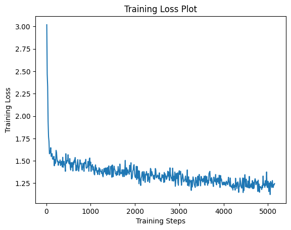
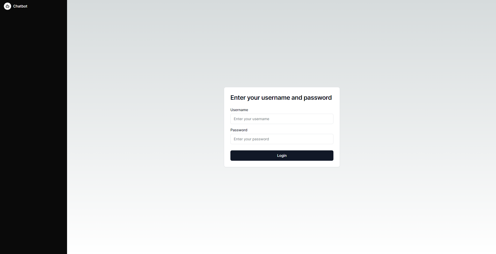
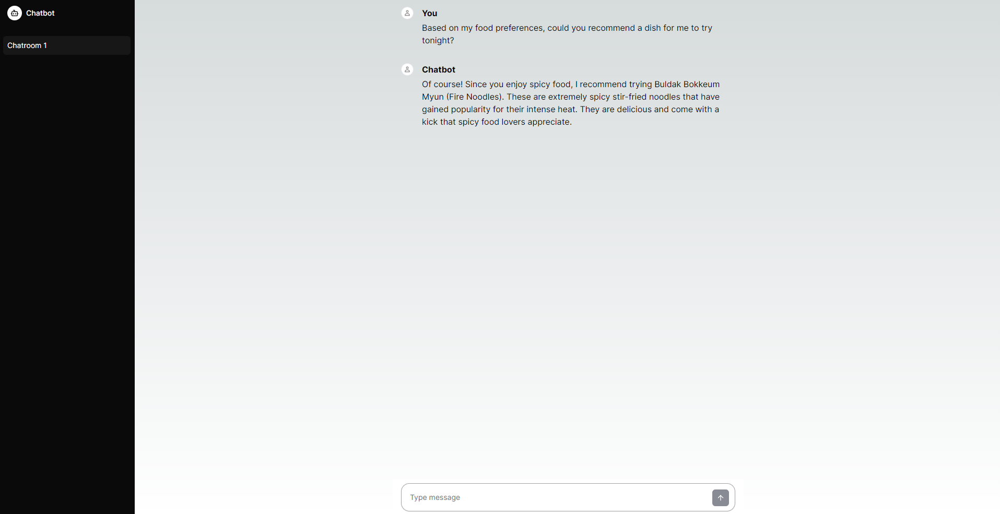

# Food Recommendation Chatbot

This project leverages a fine-tuned large language model (LLM) to provide personalized food recommendations based on user preferences.

## Table of Contents

- [Introduction](#introduction)
- [Installation](#installation)
- [Usage](#usage)

## Introduction

This food recommendation chatbot was developed using the KoAlpaca-Polyglot base model and fine-tuned using QLoRa (Quantized Low-Rank Adaptation) with a dataset of 8,000+ samples. The chatbot is powered by a WebSocket server deployed using [oobabooga/text-generation-webui](https://github.com/oobabooga/text-generation-webui), which connects with a backend built with [Spring Boot](https://spring.io/projects/spring-boot) and a UI developed using [Next.js](https://nextjs.org/docs). With this application, users can log in and interact with the chatbot by asking for food recommendations. The chatbot will utilize the trained LLM to generate relevant responses based on user queries.

The training loss plot below shows the convergence of the model during the fine-tuning process, indicating the optimization progress over epochs.



## Installation

To run the chatbot locally, follow these steps:

1. Clone the repository:
    ```bash
    git clone https://github.com/brandonthlee/food-chatbot-llm.git
    ```

2. Set up the backend (Spring Boot):
   
    Build and run the Spring Boot application:
    ```bash
    cd chatbot-backend
    mvn clean install
    mvn spring-boot:run
    ```

3. Set up the frontend (Next.js):
   
    Install dependencies and start the Next.js server:
    ```bash
    cd chatbot-frontend
    npm install
    npm run dev
    ```

4. Deploy the WebSocket server:
   
    Deploy the WebSocket server using [oobabooga/text-generation-webui](https://github.com/oobabooga/text-generation-webui) and configure it to connect with the backend.

## Usage

To use the food recommendation chatbot:

1. Log in to the application using credentials.
2. Interact with the chatbot by asking questions or providing input about your food preferences.
3. The chatbot will generate personalized food recommendations based on your queries and preferences.

### Login page



### Chat page


